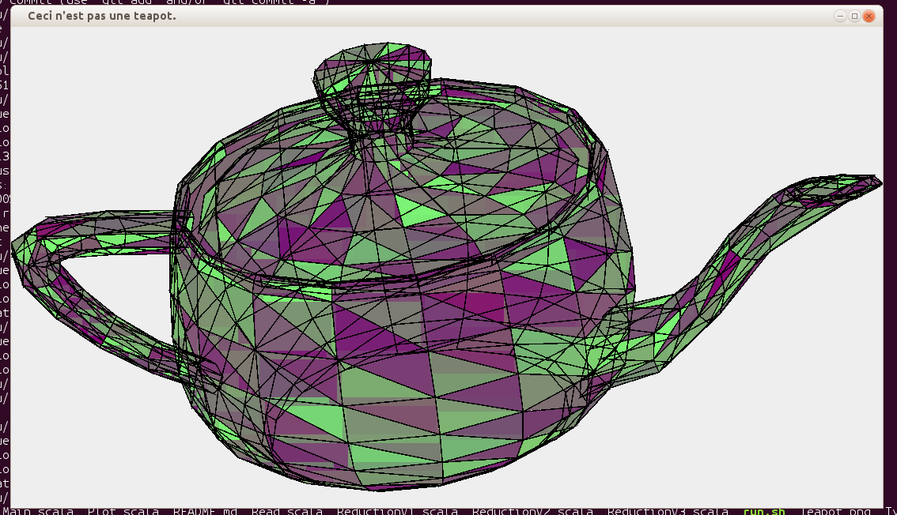

Teapot - Another Scala implementation
=====================================

Description
-----------

The actual splitTriangle function is very simple. It sorts the traingle
points by y and project the middle point on the line between the two
others. This function is used for both directions, by transposing the
coordinates of the argument and the results.

The function reduceRightToLeft contains the recursion logic. It calls
a function on every element of the input, but the function can return
either new input elements or a result. The results are returned in a
list when all input elements (original and later ones) are processed.
The function currently implements a depth-first recursion, so the
sub-triangles of a triangle will stay in the same relative position in
the list. This was because if the order is not maintained, triangles of
the back and the front of the teapot will mix, resulting in a strange
visual effect.

The reduceTriangle2D and reduceTriangle1D use for-comprehension (Scala
equiv. of Haskell's do-notation) over Eithers and Options repectivily. In
the latter case the options are used to make sure the split only happens
if the triangle is big enough and does not already have a straight
edge. Wether the triangle was split or not, is indicated by returning
the original in Left or the new ones in Right. The reduceTriangle2D
uses this in it's own for-comprehension, where the next calculation
is only executed when the previous didn't split. If both didn't split,
the result is returned, otherwise the split triangles will be returned
as inputs for a later iteration.

Plotting is done with the Swing and the Java2D API.

Running
-------

For standard mode run as

    scala Teapot.scala ../teapot.txt

or, if you want a higher threshold (i.e. less triangles), try

    scala Teapot.scala ../teapot.txt 0.5

Output
------

